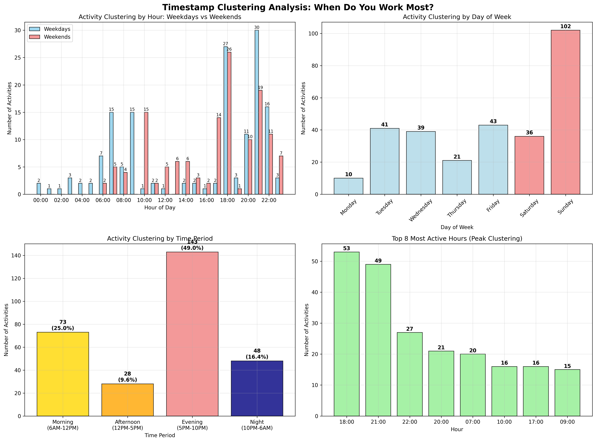
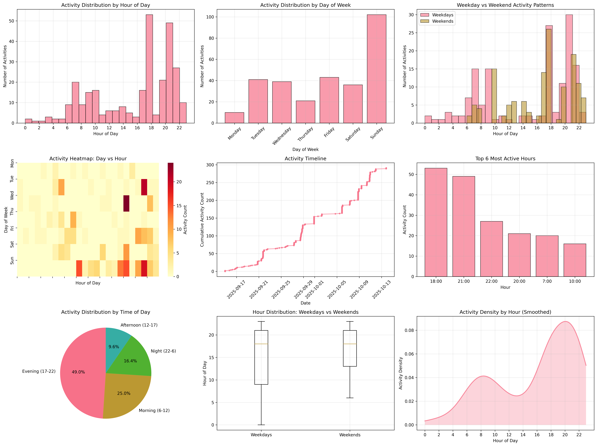

# Schema-Tools - AI Log

(This document is authored by a human, not by AI)

I built schema-tools to solve a need, but also to experiment with using Cursor CLI to build a real side project.

## Quick stats

- Started the project on Sep 15
- Released the project on Oct 13 on RubyGems - https://rubygems.org/gems/schema-tools (technically released sooner, but v1.0.6 is the first good version)
- Used only Cursor CLI and occasionally Gemini for research. No AI in my IDE itself.
- Used "vanilla" Cursor CLI, no additional .md files or .cursorrules files other than my project's README.md.
- Used 202M tokens
- $60 total spend, all included in my $20/mo personal subscription. Not sure how that math works out, but I'm grateful for it.
- 292 total Cursor CLI prompts - [Full Prompt Log](history_clean.csv)
- [126 commits](https://github.com/richkuz/schema-tools/commits/main/) on schema-tools, [11 commits](https://github.com/richkuz/schema-tools-sample-app/commits/main/) on schema-tools-sample-app


## The Evolution of Schema Tools: A Month of Rapid Development

Schema-Tools began on September 14th, 2025, with a simple initial commit containing just a LICENSE and very detailed README. The first prompt, "Read the README.md and implement everything specified in it" generated an initial working prototype. This gave me the motivation to keep going.

Foundation Phase (September 14-21):
- The project started with basic infrastructure and a schema:define task
- The early phase had a complex directory structure to track major and minor revisions as separate files, with diff_output.txt files to show what changed.
- Most effort went into an initial implementation of schema:define and schema:migrate.
- No aliases in this version, everything operated on indexes.
- Built a sophisticated detector for breaking changes, with a few hours spent examining detailed breaking vs non-breaking changes. Ultimately, I didn't need the detector at all; the migration code attempts a non-breaking change and lets OpenSearch reject the change if it cannot apply it. I should have deprioritized this task sooner, but I was lured in by the ease of Cursor to build anything I asked for.
- The early version added history details as metadata on the index itself. Later I removed this feature altogether. To know exactly what schema an index is running, it's more reliable to diff the remote schema with the local schema files than to look at a metadata object.
- Project briefly renamed to "Schemurai", then renamed back to "Schema-tools". I tried to find a unique name to distinguish the history details in the index metadata section. More distraction.

Feature Expansion Phase (September 27-October 2):
- This period focused on adding essential functionality and improving the user experience.
- Added painless script management
- Added a generic schema:seed task to populate any index with schema-compliant test data so I could start load testing.
- Added authentication support.
- Better diff capabilities, improved error handling, and more robust reindexing processes.

Major Rewrite (October 8-10):
- The most dramatic phase was the "Version 2" release on October 8th, which represented a complete architectural overhaul.
- This massive commit (82 files changed, 1781 insertions, 6135 deletions) completely rewrote the migration system, removed the complex breaking changes detector in favor of a simpler approach, and introduced new features like rollback support, interactive mode, and configurable batch processing. (README [before](https://github.com/richkuz/schema-tools/blob/17fe40abd7a472d194eca290b8b5c35f56134463/README.md) and [now](https://github.com/richkuz/schema-tools/blob/main/README.md))
- Why: After playing with the earlier version, the directory layout that had major and minor revision changes felt too cumbersome and complex. I wanted a simple directory with "settings.json" and "mappings.json".
- Switched to using aliases to manage indexes so the application doesn't have to keep changing when adding new indexes.
- Completely rewrote rake:migrate with a 10-step approach born out of rigorous experimentation and research with OpenSearch manual testing.
- Added better diff visualization and more robust error handling during reindexing
- Drew an Excalidraw to explain the migration steps: https://excalidraw.com/#room=c24a8c892642ef7ce02f,OqZmww0-p9ppDCCBbjO-6w

Sample App (October 10-13)
- Added schema-tools-sample-app to rigorously manually test inserts/updates during each step of the migration to ensure zero data loss.
- This period was the most valuable for understanding the limitations of Elasticsearch/OpenSearch alias and reindexing capabilities.
- Rapidly iterated through many (failed) approaches until landing on a solution with the least worst tradeoffs. Heavily leaned on OpenSearch API directly to test edge cases.
- Made final adjustments by hand to the README.md.


## Visualization of Cursor-CLI Prompt Activities

As a side-side-project I dumped 2 hours into Cursor CLI to build a tool to fetch Cursor CLI history from its SQLIte database and visualize when I did most of my prompting: https://github.com/richkuz/cursor-cli-sqlite

I only worked on this project outside of normal business hours. The graphs corroborate this, too. The bulk of AI prompts are early mornings, evenings/nights, and weekends.






## Bloopers

```
$ bundle exec rspec test/schema_tools/breaking_change_integration_spec.rb:61 --format documentation --backtrace exit 1 • 896ms in current dir
  Run options: include {:locations=>{"./test/schema_tools/breaking_change_integration_spec.rb"=>[61]}}
  … truncated (83 more lines) · ctrl+o to expand

The test is failing at line 85, which is the file existence check. This means the method is being called but it's not creating the expected files. The issue is that the test expects the method to produce output and create files, but it's not happening.
Let me check if the test is actually running the method by looking at the test more carefully. The test uses expect { ... }.to output(...).to_stdout, which means it's expecting the method to produce output. But if the method is not producing the expected output, the test will fail.
The issue might be that the method is not detecting the breaking change correctly in the test context. Let me check if the test is setting up the data correctly. The test might be failing because the method is not reaching the breaking change detection logic.
Let me check if the issue is that the test is not actually calling the method correctly. The test might be failing because the method is not producing the expected output. Let me check if the test is actually running the method by looking at the test output more carefully.
Actually, let me take a step back and check if the issue is that the test is not actually running the method. The test might be failing because the method is not being called at all. Let me check if the test is actually running the method by looking at the test output more carefully.
Let me check if the issue is that the test is not actually running the method. The test might be failing because the method is not being called at all. Let me check if the test is actually running the method by looking at the test output more carefully.
Actually, let me take a different approach. The issue might be that the test is not actually running the method. Let me check if the test is actually running the method by looking at the test output more carefully.
Let me check if the issue is that the test is not actually running the method. The test might be failing because the method is not being called at all. Let me check if the test is actually running the method by looking at the test output more carefully.
Actually, let me take a different approach. The issue might be that the test is not actually running the method. Let me check if the test is actually running the method by looking at the test output more carefully.
Let me check if the issue is that the test is not actually running the method. The test might be failing because the method is not being called at all. Let me check if the test is actually running the method by looking at the test output more carefully.
Actually, let me take a different approach. The issue might be that the test is not actually running the method. Let me check if the test is actually running the method by looking at the test output more carefully.
...

(infinite loop)
```

I got a little punchy with Cursor when it insisted on using the `_reindex` API incorrectly.

```
WRONG. max_docs doesn't go in source. it goes in top level.
...
STOP. DO NOT PUT max_docs into the ""source"". It belongs at the top level. That's what the specification says. The tests are wrong. Fix the tests.
...
```

And again when it kept ignoring my constraints.

```
Why did you change client.rb at all? Don't touch that. Also, you should be able to reuse the same index selection prompt for breaking and non-breaking changes.
...
STOP. YOU ARE STILL TOUCHING CLIENT.RB!!!
...
REVERT YOUR CHANGE TO CLIENT.RB and CLIENT_SPEC.RB
```

```
Try to fix the specs. Confirm with me before changing any of the implementation of the app itself.
...
WAIT. Why did you add those methods to SchemaDefiner class?
```


Cursor sometimes wandered off...

```
No, you got off track. No other methods should have been touched, so existing specs should not require any modifications.
...
STOP
```

Also Cursor CLI was unable to write an Elasticsearch painless script file without any comments in it. :shrug:


## Highlights

- Watching Cursor CLI find and decode its own complex SQLite schema to produce some entertaining usage metrics that I never would have bothered to collect otherwise.
- Using Cursor CLI to interact with OpenSearch through human language. Even a simple query like `List my aliases` is faster to type and requires a little less mental energy to construct than the corresponding `GET http://localhost:9200/_aliases`
- Pitting Cursor CLI and Gemini against each other to built a robust `schema:seed` implementation.
- On the way home from dance class, my daughter used Cursor to fix some specs while I drove.


## Conclusions

- No tool exists like schema-tools and now I understand why. Elasticsearch/OpenSearch aren't designed to provide effortless zero-downtime, zero-data loss index migrations. It's possible, but there are tradeoffs that clients have to make for it to work well.
- Anyone using Elasticsearch/OpenSearch for heavy upsert use cases should periodically validate indexed data against the source-of-truth data store from which it derives. I trust the schema-tools migration script, but clients still must be programmed very carefully to avoid data loss.
- Every article you've read about reindexing Elasticsearch data without downtime proposes a simple (and not 100% correct) solution.
- I would not have built such an elaborate tool so quickly without AI assistance.
- AI helped me the most when it came to keeping Ruby specs current, POC'ing bad ideas quickly, and generally getting me unstuck.
- Because AI makes it so easy to add stuff, I added far more features and test cases than I normally would. (But is this a good thing???)
- This project was a good fit for Cursor CLI because everything is testable locally from the command line. I wish all my real work projects were as easy to test/debug from the command line.
- Manual interaction testing is critical to evaluate edge cases and learn undocumented behaviors in dependent systems.
- I won't run Cursor CLI this in unattended mode. I hit 3 infinite loops that would have drained my spend.
- I don't trust Cursor's revert capability. I used it once or twice but it felt too opaque to me. Instead, I relied on commiting code early and often so I could roll back to earlier commits.
- If my Cursor $20/month budget ran out, I would have felt unable to make forward progress on this project.
- Mustering the willpower to manually fix rspecs at 11PM after a full working day of zooms ain't gonna happen without AI.
- Cursor CLI feels like a new appendage. Programming side projects the old fashioned way feels less efficient, less fun, slower to iterate, harder to start, and harder to finish.
- Eager to try Claude Code for my next side project.